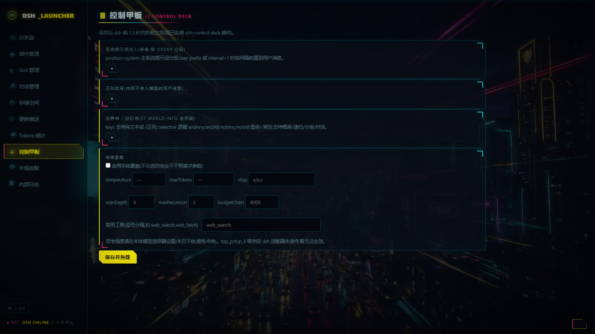
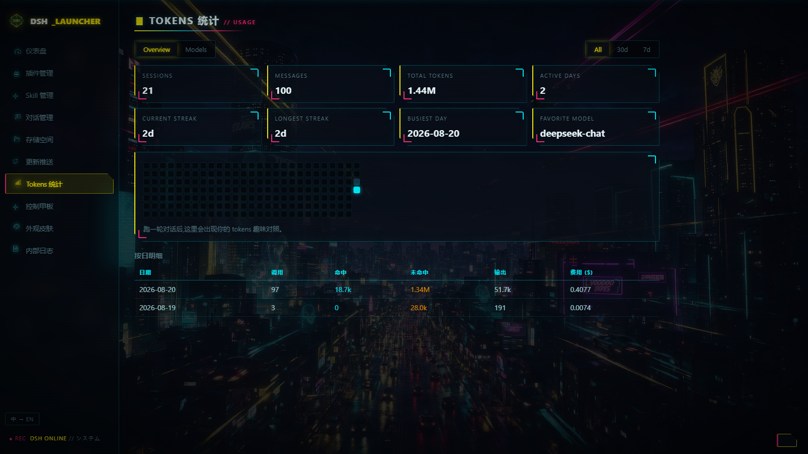

# DSH Suite — the DeepSeek Harness power-user workbench

[中文](README.zh.md) | **English**

> A complete toolkit that turns [DeepSeek Harness (dsh)](https://github.com/deepseek-ai/deepseek-harness) from a CLI tool into a visual workstation: a cyberpunk desktop launcher + 8 production-grade plugins + 6 engineering skills + 1 in-dsh skill.
> **Zero core rewrites** — every capability is delivered through official plugin extension points, so the upstream core stays independently upgradable at all times.


| SillyTavern-grade Control Deck | Skin manager + community skin market |
|---|---|
|  |  |

<details><summary>More: CC-style token analytics (heatmap / streaks / Moby-Dick easter egg)</summary>



</details>

---

## ✦ What is this

DeepSeek Harness is DeepSeek's official agent framework — powerful, but natively CLI-only with a plain web UI. DSH Suite adds on top of it:

- **A desktop launcher** (UX inspired by 秋叶 aaaki's ComfyUI packs): double-click an EXE for one-click start/stop, plugin market, skill market, skin market, token analytics, session browser, and one-click updates — all graphical;
- **The Control Deck**: SillyTavern-grade multi-entry leveled prompt injection, regex scripts, World Info lorebooks, and sampling overrides, edited in a GUI and hot-reloaded within 1.5 s;
- **A cost stack**: live multi-provider balances, automatic model price sync, cache-hit rates, and a CC-style usage heatmap;
- **Safety & speed**: destructive-command blocking, hover model prices, HTTP quick-workspace creation, and frontend skin injection.

Everything ships as **plugins / skills / a standalone launcher** — `git status` in the core repo stays clean forever.

## ✦ Quick start

Prerequisites: Windows 10/11, [Git](https://git-scm.com/), [Node.js ≥ 18](https://nodejs.org/), Edge or Chrome.

```bat
git clone https://github.com/WZZNNE/DSH-CyberWorkStation.git
cd DSH-CyberWorkStation
setup.cmd
```

`setup.cmd` automatically: uses the bundled `core/` source tree (dsh 0.1.0-rc.8; falls back to cloning upstream when absent) → installs deps and builds (build:lib + build:web) → registers all suite plugins → opens the launcher.

Daily use afterwards: double-click `launcher/DSH启动器.exe`. Manual mode: `node launcher/server.mjs` then visit `http://127.0.0.1:3090`.

> Remember to configure an API key (`OPENROUTER_API_KEY` / `DEEPSEEK_API_KEY` env vars, or `~/.dsh/settings.yaml`).
> Core checked out elsewhere? Point `DSH_REPO` at it; override the launcher port with `DSH_LAUNCHER_PORT`.

## ✦ How it differs from stock dsh (feature matrix)

| Capability | Stock dsh | Suite | Form | Authorship |
|---|---|---|---|---|
| Visual management workbench | ✗ CLI only | 10+ pages, zh/en bilingual, light/dark/system | Standalone app (EXE + zero-dep Node server) | Original |
| One-click start / stop | ✗ manual commands | Auto-opens browser on start; stop reaps the whole console process tree | Launcher | Original |
| Embedded console | ✗ separate window | Aki-style embedded console, live output, autoscroll | Launcher | Original |
| Plugin management | CLI (`dsh plugin`) | Graphical list + ~140 built-in capability rows + one-click update | Launcher | Original |
| Plugin market | ✗ | Live npm search, one-click install, jump to project page | Launcher (npm registry API) | Original |
| Skill market | ✗ | Live GitHub search, one-click install into `~/.dsh/skills` | Launcher (GitHub API) | Original |
| Community skin market | ✗ | npm skin packages are **converted in place to local CSS** and managed on the Skins page (switch/delete/import) — never leaking into the plugin system | Launcher | Converter original; skin content belongs to its authors (e.g. the [@linxin666 collection](https://github.com/zhu1090093659/dsh-web-ui)) |
| Token analytics | ✗ | GitHub-style heatmap, streaks, per-model split, daily detail | Launcher (reads cost-meter-plus ledger) | Original |
| Costs / balances | ✗ | Live balances (OpenRouter/OpenAI/local), auto price catalog sync, cache-hit strip | Plugin `dsh-cost-meter-plus` | Fork of [Han-1413141/dsh-cost-meter](https://github.com/Han-1413141/dsh-cost-meter) (MIT) |
| Usage panel, de-peaked | - | Removes peak/off-peak price display | Plugin `dsh-token-usage-plus` | Fork of [Tastelessor/dsh-usage-stats](https://github.com/Tastelessor/dsh-usage-stats) (MIT) |
| Destructive-command blocking | ask-confirm only | 38 pattern classes denied outright (`rm -rf`, format, registry, …) | Plugin `dsh-safe-guard` | Original |
| Control Deck (ST-grade) | ✗ | See the tutorial below | Plugin `dsh-control-deck` | Original; semantics aligned with [SillyTavern](https://github.com/SillyTavern/SillyTavern) (behavior reference, no code included) |
| Frontend skin injection | ✗ | Injects `~/.dsh/frontend-skin.css` into the dsh web UI | Plugin `dsh-skin-loader` | Original |
| Hover model prices | ✗ | Model picker shows input/output USD per million tokens on hover | Plugin `dsh-price-hint` | Original |
| Quick workspace | manual GUI steps | One-click HTTP creation by absolute path | Plugin `dsh-quick-workspace` | Original |
| AI skin studio (one-shot skins) | ✗ | Ask the agent for a launcher/frontend skin in chat: it gathers requirements first (style/colors/light-dark/background art), **asks the user for an image instead of fabricating one** when it cannot generate images (or calls an image-generation tool when it can), inlines local art as data URIs, and installs+applies in one call | Plugin `dsh-skin-studio` (registers the `skin_studio` tool) + dsh skill `skin-studio` | Original |
| Engineering skills | ✗ | Architecture / plugin / frontend / ops / playbook / testing six-pack | Claude Code skills | Original |
| **Core rewrites** | - | **0 lines** — everything above goes through official extension points | - | - |

## ✦ Control Deck tutorial

> "Control Deck" page in the launcher sidebar. Every save **hot-reloads within 1.5 s** — no dsh restart. Semantics match SillyTavern, so ST veterans feel at home instantly.

### 1. Prompt injection (multi-entry, leveled)

Each entry has:
- **Name / text**: what gets injected;
- **order**: lower numbers sort earlier — multiple entries stack by order;
- **position**: `system` (into the system prompt) or `user-prefix` (prepended to the user message);
- **interval**: 1 = every step; N>1 = once every N steps (periodic reminders);
- **enabled**: toggle per entry without deleting it.

### 2. Regex scripts (ST runRegexScript semantics)

Rewrites user input / world-info content, with SillyTavern-compatible fields:
- **findRegex** (flags supported) and **replaceString** with `{{match}}` (whole match) and `$1…$9` capture groups;
- **trimStrings**: substrings stripped from the match before it fills `{{match}}`;
- **placement**: scope — `user_input` or `world_info`.

### 3. World Info (full ST field set)

Scans recent conversation and injects lore when keys match:
- **keys**: primary keywords, `/regex/flags` supported; **secondaryKeys + selectiveLogic**: `andAny / andAll / notAny / notAll`;
- **constant 🔵**: always injected, no key needed; **probability**: percentage gate after a match;
- **order / position**; **caseSensitive / matchWholeWords** (whole-word by default, auto-skipped for CJK text);
- **Recursion**: one entry's content can trigger another (`excludeRecursion / preventRecursion / delayUntilRecursion` + global `maxRecursionSteps`);
- **inclusion group + groupWeight**: mutually exclusive within a group, weighted pick;
- **sticky / cooldown / delay** measured in message counts;
- **Global settings**: `scanDepth` (how many recent messages to scan) and `budgetChars` (injection budget).

### 4. Sampling overrides (with a master switch)

**When "enable sampling override" is unchecked, the plugin touches no request parameters at all** — nothing can be passed by accident. When checked, you can override temperature, maxTokens, and stop sequences (up to 4).
Reasoning effort is deliberately **not** in the Control Deck: the native model picker already owns it, and two controllers would fight.

### 5. Tool switches

List tool names to deny them at the `tools/pre-execute` stage (e.g. disable `web_search`).

## ✦ Launcher page tour

| Page | What it does |
|---|---|
| Dashboard | Status (RUNNING flip effect), core & Node versions, default model, start (lightning FX) / stop |
| Plugins | Installed plugins + built-in capability list, market search & install, one-click update |
| Skills | Local skill list + GitHub market install |
| Sessions | Browse all sessions with message counts, jump to their storage |
| Storage | Sizes per store, one-click open |
| Update | One-click git pull + build for core / plugins, live progress log |
| Tokens | Totals & hit-rate overview, GitHub-style heatmap, streaks, per-model, daily detail |
| Skins | Launcher skins and dsh frontend skins managed separately: switch / delete / CSS import / community market |
| Control Deck | The ST-grade editor described above |
| Quick workspace | Create a workspace from an absolute path (dsh must be running) |
| Logs | Launcher internals / dsh output / update logs |

The 🌐 icon at the bottom-left switches zh/en; the default skin supports light / dark / follow-system.

## ✦ The skin system

- **Launcher skins** (`launcher/skins/launcher/`): `cyberpunk-2077` (Cyberpunk 2077 × Edgerunners, Jimeng-AI-generated art), `default` (three-state theme), and `onimai` (original CSS skin inspired by the onimai.jp website — its artwork is NOT bundled; copy your own `assets/onimai/` artwork into `launcher/public/assets/onimai/` to use it).
- **dsh frontend skins** (`launcher/skins/frontend/`): injected into the dsh web UI via the `dsh-skin-loader` plugin. Pick "(none)" to restore stock looks.
- **Community skin market**: search npm skin packages and install with one click (results are double-filtered for the dsh ecosystem + skin semantics, so unrelated packages never slip in). The launcher **converts each package in place into a single local CSS file** (manifest-v2 asset dirs, legacy client.js plugin format, plain CSS packages, and aggregator shells via one-level recursion are all supported); background art is inlined as data URIs and layered exactly like the original skin-center runtime — painted on the body above its background color, beneath the translucent panels, with light/dark variants following the dsh theme attribute. Converted skins are then switched/deleted like your own — skins never end up in the plugin system. Converted files are git-ignored (copyright stays with the original authors).

## ✦ Plugin roster

| Plugin | Responsibility | Tests |
|---|---|---|
| `dsh-control-deck` | ST-grade prompts/regex/lorebook/sampling (pure-function engine + thin host shell) | 26 (11 semantics + 15 adversarial) |
| `dsh-safe-guard` | Destructive-command denial (deny, no confirm noise) | 44 (38 + 6 bypass-adversarial) |
| `dsh-cost-meter-plus` | Balances / prices / cache hits / ledger | 6 |
| `dsh-token-usage-plus` | De-peaked usage panel | - |
| `dsh-skin-loader` | Frontend skin injection | - |
| `dsh-price-hint` | Hover model prices | - |
| `dsh-quick-workspace` | HTTP quick workspace | - |
| `dsh-skin-studio` | Model-facing skin studio: the `skin_studio` tool plus a guided requirements flow, installing through the launcher API; companion dsh skill (`dsh-skills/skin-studio`, installed to `~/.dsh/skills/`) carries the variable tables and templates | 9 (4 + 5 adversarial) |

## ✦ Engineering skills (six-pack)

Copy the folders under `skills/` into `~/.claude/skills/` and Claude Code masters the dsh codebase:
`dsh-architecture` (Cordis model) · `dsh-plugin-dev` (plugin contract) · `dsh-frontend-dev` (client slots) · `dsh-env-ops` (environment ops) · `dsh-playbook` (tuning playbook) · `dsh-testing` (test layering).

## ✦ Why zero core rewrites work

dsh is built on the Cordis plugin framework; the suite only uses these **official extension points**:

- `ctx.systemPrompt.section()` — sectioned system-prompt injection;
- `agent/pre-step` — rewrite messages entering the model (regex / world info / prefixes);
- `agent/request` — merge request parameters (sampling overrides);
- `tools/pre-execute` — allow/deny tool calls (safety blocking / tool switches);
- `ctx.webServer.register()` — mount HTTP endpoints (quick workspace / skin serving);
- the client `__ModuleLoader__` slot — frontend injection (skins / price hints).

The launcher is a fully separate process that talks to the core only via CLI and HTTP.

## ✦ FAQ

**Q: A task failed with `MISSING_CREDENTIAL: deepseek-official` — is that a bug?**
No. dsh sessions **pin the model chosen at creation time**. If a session was created on the official DeepSeek model while you only configured an OpenRouter key, that session keeps using the official channel and reports the missing credential. Fix: start a new session (default model shows on the dashboard), switch models inside the session, or add `DEEPSEEK_API_KEY`.

**Q: Where did my market-installed skin go?**
The "dsh frontend skins" section of the Skins page — never the plugin list (v1 briefly installed them as plugins; that's fixed, with conversion).

**Q: UI changes not showing?**
Browser cache — hard-refresh with `Ctrl+F5`.

**Q: Do Control Deck edits need a restart?**
No — saves hot-reload within 1.5 s.

## ✦ License & credits

Original suite code is MIT (see [LICENSE](LICENSE)). Forked plugins keep their upstream MIT licenses: [dsh-cost-meter](https://github.com/Han-1413141/dsh-cost-meter) (Han-1413141), [dsh-usage-stats](https://github.com/Tastelessor/dsh-usage-stats) (Tastelessor). Control Deck semantics align with [SillyTavern](https://github.com/SillyTavern/SillyTavern) (behavior reference only, no code included). Community skin content belongs to its authors (Maid Atelier is CC BY-NC-SA 4.0, non-commercial). Launcher artwork generated with Jimeng AI by the suite author. The onimai skin's artwork comes from the official onimai.jp website and is not redistributed — obtain it yourself. `dsh-skin-center` is a local rebrand of [@linxin666/dsh-client-ui-skin-center](https://github.com/zhu1090093659/dsh-web-ui) (Apache-2.0). Launcher UX pays homage to [秋叶 aaaki's ComfyUI pack launcher](https://space.bilibili.com/12566101).
