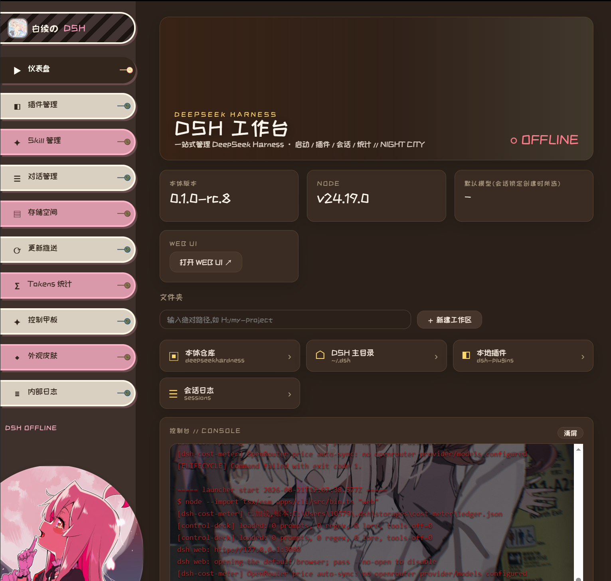
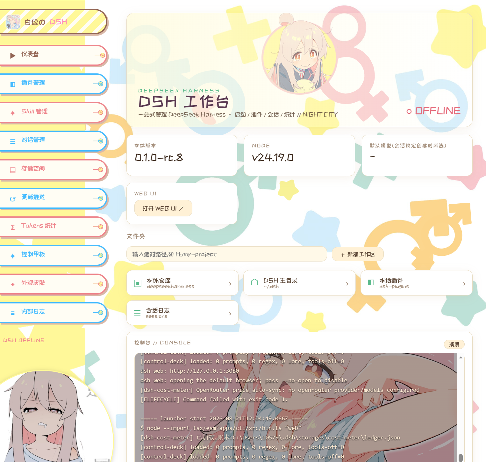

# DSH CyberWorkStation — 绪山真寻主题美化改版

**中文** | [English](README.md)

> 由 **bailing** 基于 DSH Suite 工作台进行的**绪山真寻**(Mahiro Oyama,《别当欧尼酱了！》)主题美化改版,让 [DeepSeek Harness (dsh)](https://github.com/deepseek-ai/deepseek-harness) 从"命令行工具"变成"可视化工作站":真寻主题动漫风格桌面启动器 + 9 个生产级插件 + 6 个工程 Skill + 1 个 dsh 内 Skill。
> **不改本体一行代码** —— 全部能力通过官方插件扩展点外挂实现,本体随时可独立升级。





---

## ✦ 美化亮点

本改版的目标是让启动器的每一像素都还原 onimai.jp 官网的观感:

- **绪山真寻皮肤** —— 启动器整体换肤为真寻主题(以 `onimai` 启动器皮肤形式随包分发):侧边栏还原 onimai.jp 官网背景布局、左下角圆形头像按钮、粒子背景、站酷快乐体字体、真实的占比与悬停态;
- **亮 / 暗 / 跟随系统三主题** —— 可在皮肤页切换,或**双击左下角图片**即时切换;每个主题有专属的日志框背景图:暗色模式用深色底图 + 深色遮罩 + 红黑文字投影保证可读性,亮色模式用暖白奶油配色 + 轻遮罩;
- **一个按钮,两种手势** —— 左下角图片同时承担语言与主题切换:**单击**切换中英文(完整圆扇形过场动画 + 刷新),**双击**切换亮/暗主题(即时生效,不刷新);
- **改壳皮肤中心** —— 本地改壳 [@linxin666](https://github.com/zhu1090093659/dsh-web-ui) 的 dsh-skin-center 插件(Apache-2.0),内置 **16 款社区皮肤**(Maid Atelier、芙宁娜、初音、矩阵、龙裔、鲸歌……),皮肤页一键切换;
- **细节打磨** —— 完整圆过场动画、还原官网占比的圆形按钮、漂浮粒子、刷新/加载动效、中英双语界面。

## ✦ 这是什么

DeepSeek Harness 是 DeepSeek 官方的 agent 运行框架,功能强大但原生只有命令行和一个朴素的 Web UI。本项目在它之上补齐了:

- **桌面启动器**(参考秋叶 ComfyUI 整合包的体验):双击 EXE,一键启动/退出、插件市场、Skill 市场、皮肤市场、tokens 统计、会话浏览、一键更新,全部图形化;
- **控制甲板**:SillyTavern 级的提示词多条分级注入、正则脚本、世界书(World Info)、采样参数控制,在图形界面编辑、1.5 秒热载生效;
- **费用体系**:多 API 余额实时显示、模型价格自动同步、缓存命中率、CC 风格用量热力图;
- **安全与效率**:危险命令拦截、模型价格悬停提示、HTTP 快建工作区、前端皮肤注入。

一切以 **插件 / Skill / 独立启动器** 形式存在,`git status` 里本体仓库永远干净。

## ✦ 快速开始

前置:Windows 10/11、[Git](https://git-scm.com/)、[Node.js ^22.19 || ≥24](https://nodejs.org/)、Edge 或 Chrome。

```bat
git clone https://github.com/bailingsancun/DSH-CyberWorkStation-skin.git
cd DSH-CyberWorkStation-skin
setup.cmd
```

`setup.cmd` 会自动:克隆上游本体并**锁定 `dsh-v0.1.0-rc.8`**(套件插件所针对的 API 版本;约 1.5GB,本地已有 `core/` 时跳过)→ 安装依赖并构建(build:lib + build:web)→ 注册全部 9 个插件到 web profile → 打开启动器。

之后每次使用:双击 `launcher/DSH启动器.exe`。手动模式:`node launcher/server.mjs` 后访问 `http://127.0.0.1:3090`。

> 记得配置 API Key(环境变量 `OPENROUTER_API_KEY` / `DEEPSEEK_API_KEY` 等,或 `~/.dsh/settings.yaml`)。
> 本体检出在别处?设环境变量 `DSH_REPO` 指向它;启动器端口用 `DSH_LAUNCHER_PORT` 覆盖。

## ✦ 与本体的区别(功能对比总表)

| 能力 | 本体原生 | 套件提供 | 实现形式 | 作者归属 |
|---|---|---|---|---|
| 可视化管理工作台(启动器) | ✗ 仅 CLI | 10+ 功能页、中英双语、明/暗/跟随系统 | 独立程序(EXE + 零依赖 Node 服务) | 原创 |
| 一键启动 / 退出 | ✗ 手动命令 | 启动即开浏览器;退出连控制台进程树一起收干净 | 启动器 | 原创 |
| 内嵌控制台 | ✗ 独立黑窗 | 秋叶式内嵌控制台,实时输出、自动滚动 | 启动器 | 原创 |
| 插件管理 | CLI(`dsh plugin`) | 图形化列表 + ~140 行内置能力清单 + 一键更新 | 启动器 | 原创 |
| 插件市场 | ✗ | npm 实时搜索、一键安装、跳转项目主页 | 启动器(npm registry API) | 原创 |
| Skill 市场 | ✗ | GitHub 实时搜索、一键装入 `~/.dsh/skills` | 启动器(GitHub API) | 原创 |
| 社区皮肤市场 | ✗ | npm 皮肤包**就地转换为本地 CSS**,皮肤页统一 切换/删除/导入,绝不混进插件系统 | 启动器 | 转换器原创;皮肤内容归原作者([@linxin666 系列](https://github.com/zhu1090093659/dsh-web-ui)等) |
| Tokens 统计 | ✗ | GitHub 风格热力图、连续天数、按模型拆分、按日明细 | 启动器(读取 cost-meter-plus 账本) | 原创 |
| 费用 / 余额 | ✗ | 余额实时显示(OpenRouter/OpenAI/本地)、价格目录自动同步、缓存命中条 | 插件 `dsh-cost-meter-plus` | Fork [Han-1413141/dsh-cost-meter](https://github.com/Han-1413141/dsh-cost-meter)(MIT) |
| 用量面板(去峰谷) | - | 移除峰谷计价显示 | 插件 `dsh-token-usage-plus` | Fork [Tastelessor/dsh-usage-stats](https://github.com/Tastelessor/dsh-usage-stats)(MIT) |
| 危险命令拦截 | 仅确认 | 38 类模式直接拒绝(`rm -rf`、格式化、注册表……) | 插件 `dsh-safe-guard` | 原创 |
| 控制甲板(ST 级) | ✗ | 见下文 | 插件 `dsh-control-deck` | 原创;语义对齐 [SillyTavern](https://github.com/SillyTavern/SillyTavern)(仅行为参考,不含代码) |
| 前端皮肤注入 | ✗ | 把 `~/.dsh/frontend-skin.css` 注入 dsh Web UI | 插件 `dsh-skin-loader` | 原创 |
| 模型价格悬停提示 | ✗ | 模型选择器悬停显示 输入/输出 美元/百万 tokens | 插件 `dsh-price-hint` | 原创 |
| 快建工作区 | 手动 GUI 步骤 | 按绝对路径一键 HTTP 创建 | 插件 `dsh-quick-workspace` | 原创 |
| AI 皮肤工坊(一次成肤) | ✗ | 对话中让 agent 生成启动器/前端皮肤:先收集需求(风格/配色/亮暗/背景图),**无法生成图片时向用户要图而不是编造**,本地图片内联为 data URI,一次调用完成安装+应用 | 插件 `dsh-skin-studio`(注册 `skin_studio` 工具)+ dsh skill `skin-studio` | 原创 |
| 工程 Skill | ✗ | 架构 / 插件 / 前端 / 运维 / 调参 / 测试 六件套 | Claude Code skills | 原创 |
| **本体改动** | - | **0 行** —— 以上全部走官方扩展点 | - | - |

## ✦ 控制甲板(简介)

> 启动器侧边栏"控制甲板"页。每次保存 **1.5 秒内热载生效** —— 无需重启 dsh。语义与 SillyTavern 一致,ST 老用户零学习成本。

1. **提示词注入(多条、分级)** —— 每条:名称/内容、`order`(排序堆叠)、`position`(`system` / `user-prefix`)、`interval`(1 = 每步)、`enabled` 开关;
2. **正则脚本(ST runRegexScript 语义)** —— `findRegex` + `replaceString`,支持 `{{match}}` 与 `$1…$9` 捕获组、`trimStrings`、`placement`(`user_input` / `world_info`);
3. **世界书(完整 ST 字段集)** —— 关键词/正则 key + `andAny/andAll/notAny/notAll` 逻辑、常驻 🔵 条目、概率门、整词匹配(CJK 自动跳过)、递归控制、包含组权重、sticky/cooldown/delay、全局 `scanDepth` + `budgetChars`;
4. **采样参数覆盖(带总开关)** —— 默认关闭,请求参数绝不泄漏;开启后可覆盖 temperature、maxTokens、停止序列(≤4)。思考强度刻意不放入控制甲板(原生模型选择器已拥有);
5. **工具开关** —— 在 `tools/pre-execute` 阶段拒绝指定工具(如禁用 `web_search`)。

## ✦ 启动器页面导览

| 页面 | 功能 |
|---|---|
| 仪表盘 | 运行状态(RUNNING 翻牌特效)、本体版本、Node 版本、默认模型、一键启动(电流特效)/退出 |
| 插件管理 | 已安装插件 + 内置能力清单、市场搜索一键安装、一键更新 |
| Skill 管理 | 本地 Skill 列表 + GitHub 市场一键安装 |
| 会话 | 浏览全部会话与消息数,跳转其存储位置 |
| 存储 | 各存储库大小,一键打开 |
| 更新 | 本体 / 插件一键 git pull + 构建,实时进度日志 |
| Tokens | 总量与命中率总览、GitHub 风格热力图、连续天数、按模型、按日明细 |
| 皮肤 | 启动器皮肤与 dsh 前端皮肤分开管理:切换 / 删除 / CSS 导入 / 社区市场 |
| 控制甲板 | 上文所述 ST 级编辑器 |
| 快建工作区 | 按绝对路径创建工作区(dsh 需在运行) |
| 日志 | 启动器内部 / dsh 输出 / 更新日志 |

左下角 🌐 图片:**单击**切换中英文(扇形过场),**双击**切换亮/暗主题。

## ✦ 插件名录

| 插件 | 职责 |
|---|---|
| `dsh-control-deck` | ST 级提示词/正则/世界书/采样(纯函数引擎 + 薄宿主壳) |
| `dsh-safe-guard` | 危险命令拦截(直接拒绝,不弹确认噪音) |
| `dsh-cost-meter-plus` | 余额 / 价格 / 缓存命中 / 账本 |
| `dsh-token-usage-plus` | 去峰谷用量面板 |
| `dsh-skin-loader` | 前端皮肤注入 |
| `dsh-price-hint` | 模型价格悬停提示 |
| `dsh-quick-workspace` | HTTP 快建工作区 |
| `dsh-skin-studio` | 面向模型的皮肤工坊:`skin_studio` 工具 + 引导式需求流程 |
| `dsh-skin-center` | 本地改壳 @linxin666 皮肤中心 —— 内置 16 款皮肤,皮肤页一键切换 |

## ✦ 工程 Skill(六件套)

把 `skills/` 下的文件夹复制到 `~/.claude/skills/`,Claude Code 即可掌握 dsh 代码库:
`dsh-architecture`(Cordis 模型)· `dsh-plugin-dev`(插件契约)· `dsh-frontend-dev`(客户端插槽)· `dsh-env-ops`(环境运维)· `dsh-playbook`(调参手册)· `dsh-testing`(测试分层)。

## ✦ 为什么零本体改动可行

dsh 基于 Cordis 插件框架,套件只用这些**官方扩展点**:

- `ctx.systemPrompt.section()` —— 分节系统提示注入;
- `agent/pre-step` —— 改写进入模型的消息(正则 / 世界书 / 前缀);
- `agent/request` —— 合并请求参数(采样覆盖);
- `tools/pre-execute` —— 放行/拒绝工具调用(安全拦截 / 工具开关);
- `ctx.webServer.register()` —— 挂载 HTTP 端点(快建工作区 / 皮肤服务);
- 客户端 `__ModuleLoader__` 插槽 —— 前端注入(皮肤 / 价格提示)。

启动器是完全独立的进程,只通过 CLI 与 HTTP 与本体通信。

## ✦ FAQ

**Q: 任务报 `MISSING_CREDENTIAL: deepseek-official` 是 bug 吗?**
不是。dsh 会话**锁定创建时选择的模型**。若会话在官方 DeepSeek 模型上创建,而你只配置了 OpenRouter key,该会话会继续走官方通道并报缺凭据。解决:新开会话、在会话内切换模型,或添加 `DEEPSEEK_API_KEY`。

**Q: 我市场装的皮肤去哪了?**
皮肤页的"前端(dsh Web UI)皮肤"区 —— 绝不会进插件列表。

**Q: UI 改了没生效?**
浏览器缓存 —— `Ctrl+F5` 强制刷新。

**Q: 控制甲板改完要重启吗?**
不用 —— 保存后 1.5 秒内热载生效。

## ✦ 皮肤系统与素材说明

- **启动器皮肤**(`launcher/skins/launcher/`):`cyberpunk-2077`(赛博朋克 2077 × 边缘行者,即梦 AI 生成)、`default`(三态主题),以及 **`onimai`**(本美化改版的招牌**绪山真寻主题皮肤**,素材来自 onimai.jp 官网 —— 随包分发仅供**非商用**使用);
- **dsh 前端皮肤**(`launcher/skins/frontend/`):经 `dsh-skin-loader` 插件注入 dsh Web UI。选「(无)」恢复原生外观;
- **社区皮肤市场**:npm 皮肤包一键搜索安装(双重过滤 dsh 生态 + 皮肤语义);每个包**就地转换为单个本地 CSS 文件**,在皮肤页统一管理 —— 皮肤绝不混进插件系统。转换产物 git 忽略(版权归原作者);
- **16 款内置皮肤**随 `dsh-skin-center` 分发,每款自带 LICENSE / NOTICE。

## ✦ 许可与致谢

套件原代码为 MIT(见 [LICENSE](LICENSE));本美化改版(**bailing** 的 onimai 皮肤 CSS、主题逻辑、改壳)同为 MIT。Fork 插件保留上游 MIT 许可:[dsh-cost-meter](https://github.com/Han-1413141/dsh-cost-meter)(Han-1413141)、[dsh-usage-stats](https://github.com/Tastelessor/dsh-usage-stats)(Tastelessor)。控制甲板语义对齐 [SillyTavern](https://github.com/SillyTavern/SillyTavern)(仅行为参考,不含代码)。社区皮肤内容归原作者(Maid Atelier 为 CC BY-NC-SA 4.0,非商用)。onimai 皮肤素材来自 onimai.jp 官网,随仓库分发仅供**非商用**使用(版权归原作者)。`dsh-skin-center` 为 [@linxin666/dsh-client-ui-skin-center](https://github.com/zhu1090093659/dsh-web-ui) 的本地改壳(Apache-2.0)。站酷快乐体字体遵循站酷字库免费商用授权。启动器美术由套件作者用即梦 AI 生成。启动器交互致敬[秋叶 aaaki 的 ComfyUI 整合包启动器](https://space.bilibili.com/12566101)。
